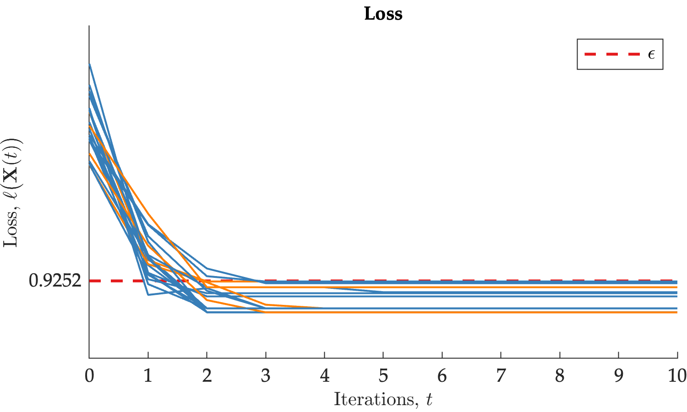

---

layout: single
title: "Max-Plus Synchronization in Decentralized Trading
Systems"
date: 2023-04-18
header:  
  teaser: graph.png
tags:
  - Lattice Theory
  - Economics
  - Tropical Geometry
---

I'm excited to share our [new paper](https://arxiv.org/pdf/2304.00210.pdf) with [Michael Munger](http://www.michaelmunger.com) and [Michael Zavlanos](https://www.michaelmzavlanos.org) in which we introduce a decentralized mechanism for pricing and exchanging alternatives constrained by transaction costs. This has been a really fun (ongoing) interdisciplinary collaboration between the Department of ECE and Economics at Duke.

Our decentralized model is based on max-plus (linear) algebra, a branch of tropical geometry. There is (unfortunately!) [nothing tropical](https://mathoverflow.net/questions/76189/whats-tropical-about-tropical-algebra) about tropical geometry. If anything, it is indicative of what the French though of Brazil, the birthplace of the pioneer of the field, in the 1980s.

The recipe for max-plus algebra is ridiculously simple.

* Replace $\times \leftarrow +$.
* Replace $+ \leftarrow \max$.

Now, carry out arithmetic in the usual way... For instance, $2 + 3$ is $3$ (i.e. the max of $2$ and $3$), but $2 \times 3$ is  $5$. If $\mathbf{A}$ is an $m$-by-$n$ matrix and $\mathbf{x}$ is a column vector. Then, we define matrix-vector multiplication

$$
  [\mathbf{A} \boxplus \mathbf{x}]_i = \max_{j=1}^{n} [\mathbf{A}]_{i,j} + \mathbf{x}_j.
$$

Thus, max-plus algebra in a combinatorial reinvention of linear algebra...with varying degrees of success, e.g. eigenvalues, [linear systems](https://link.springer.com/article/10.1007/s10626-019-00294-w), [least-squares](https://ieeexplore.ieee.org/document/9394420),... etc. Things get weird pretty quickly (e.g. in [Peron-Frobenius theory](http://www.cmap.polytechnique.fr/~gaubert/PAPERS/gaubert-code2007.pdf) if a square matrix is irreducible, then it has exactly one max-plus eigenvalue).

Max-plus algebra is a tool we add to our arsenal for our purposes of modeling trade. The key observation is that if $\mathbf{x} \in \mathbb{R}^d$ is a vector of values for a set of alternatives $\mathcal{X} = \{ 1, 2, \dots, d \}$ and $\mathbf{A}$ is a $d$-by-$d$ matrix with $[\mathbf{A}]_{i,j}$ being the negative cost (or positive value) for exchanging alternative $j$ for $i$, then

$$
    \underbrace{\left[ \mathbf{A} \boxplus \mathbf{x} \right]_i}_{\mathsf{Effective}\,\mathsf{Value}\,(i)} = \max_{j=1}^{d} \Bigl\{\underbrace{[\mathbf{x}]_j}_{\mathsf{Reservation}\,\mathsf{Value}(j)} + \quad \underbrace{[\mathbf{A}]_{i,j}}_{\mathsf{Cost}(j \to i)} \Bigr\}. \label{eq:relative-demand}
$$

We may think of this as an optimization problem in which we price alternative $i$ according to the highest possible trade we could make for $i$ less transactions costs.

Things get more interesting when we no longer have one seller and one buyer but an entire network of buyers/sellers. Then, each agent has a matrix of transaction costs for each potential buyer. Thus, we use max-plus algebra to model the effective value of alternatives (e.g. goods, [property rights](https://www.aier.org/article/manners-the-coase-theorem-and-a-park-bench-in-london/), even [opinions](https://arxiv.org/pdf/2005.12798.pdf)), taking into account transaction costs with neighbors in a trade network. This results in the data of a max-plus matrix-weighted graph.

For the mathematician in the room, this data is *really* a **cellular sheaf valued in the category of semimodules (over the max-plus semiring) over a graph** (the trading network). There has been some previous work here, for instance, to characterize [max-flow min-cut](https://arxiv.org/pdf/1409.6712.pdf) duality, or modeling [quantum nonlocality](https://arxiv.org/pdf/2104.11411.pdf).

Suppose a trade network has $N$ nodes and there are $d$ alternatives. The mathematical contribution of our paper is a characterization of the time-invariant solutions of a heat equation

$$
 \mathbf{X}(t+1) = \mathcal{L} \left( \mathbf{X}(t) \right) \wedge \mathbf{X}(t)
$$

with

$$
\mathbf{X} = \begin{bmatrix}  \mathbf{X}_1 \\ \mathbf{X}_2 \\ \vdots \\  \mathbf{X}_N \end{bmatrix} \in \mathbb{R}_{\max}^{N \cdot d}
$$

involving a weighted Tarski Laplacian

$$
        \mathcal{L}(\mathbf{X})_u = \bigwedge_{v \in \mathcal{N}_u} [\mathbf{W}]_{u,v} +' \mathbf{A}^{\ast}_{u,v} \boxplus' \left( \mathbf{A}_{v,u} \boxplus \mathbf{X}_v \right).
$$

We also study the algebraic properties of the solution sets and the convergence behavior of the dynamical system. For instance, the time-invariant solutions of (2) form a sub-semimodule.

Our contribution to the economics literature is theoretical evidence that differences in a) competitive equilibrium, b) bargaining, or c) cost-benefit analysis are due to differences in the way that transaction costs are incorporated into the decision-making process. In our analysis, we classified trajectories of the heat equation as either 1) converging to an approximate value equilibrium, or b) converging to the stable manifold. The second regime, we interpret, as never-ending negotiations between agents--equilibrium is never reached. Further investigation of this phenomenon--both on the side of economics and mathematics--is subject to future work.

We also presented numerical simulations of the synchronization algorithm which we call **R**esiduate **R**escale **Ag**gregate **U**pdate (RRAggU).

Our results demonstrate that trajectories of the heat equation (2) converge to an approximate value equilibrium.

Our code is availabe [here](https://github.com/hans-riess/RRAgU).
